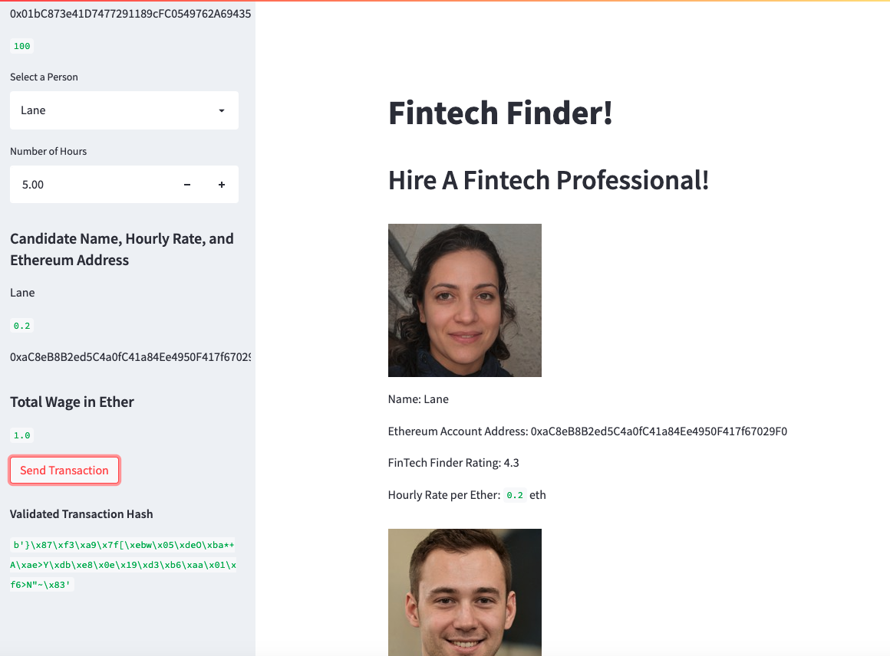
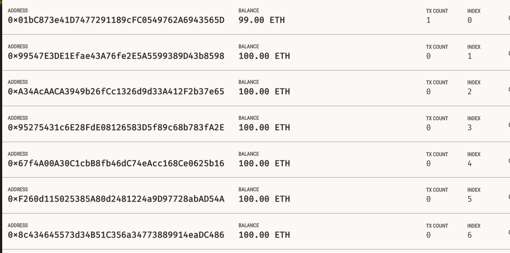
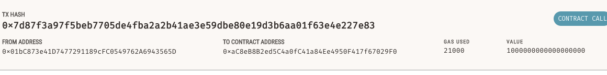

# Blockchain Wallet

In this project, a blockchain-based ledger system is built with a user-friendly web interface. 
This ledger enables partner banks to undertake financial transactions (i.e., money transfers between senders and receivers) as well as validate the ledger's data integrity.


---

## Technologies

This project leverages VS Code and Streamlit.

---

## Installation Guide

Before running the application, please install the following libraries and dependencies

```python

pip install streamlit

import streamlit as st
from dataclasses import dataclass
from typing import Any, List
from web3 import Web3
w3 = Web3(Web3.HTTPProvider('HTTP://127.0.0.1:7545'))

```

Then, clone the repository onto your local computer.

---

## Program Usage

For Mac user, open terminal then navigate to your folder.

Then open the program with the following command.

```python
streamlit run fintech_finder.py
```

The following screen will load up.


  
Next, on the left side of the screen, you can choose who to send cryptocurrency to (ETH in this case).
Let's pick Lane and indicate that she works for 5 hours as the following shows.

You will see that the total wage in Ether is 0.2 * 5 = 1.0 Ether to send to Lane.
Then, click 'Send Transaction' button. 


On the lower left side of the screen, you can see that the transaction hash is validated after you click 'Send Transaction' button.



If you go over to Ganache, you can see that 1.0 Ether has been deducted from your account to become 99.00 ETH as follows.



If you check out the transaction log in Ganache, you can see that the transaction has been recorded.




---

## Contributors

Initial code is provided by: UC Berkeley Fintech Bootcamp

Code is modified by: Kevin BaRoss [[LinkedIn](https://www.linkedin.com/in/kevin-baross/)]


---
